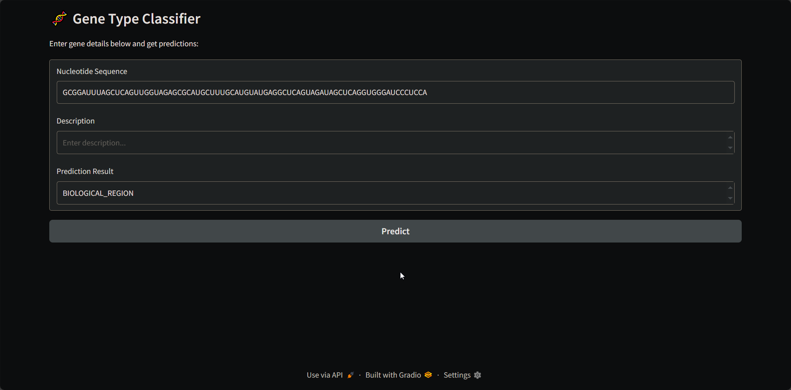

# GeneTypeClassifier — Fast gene type prediction with a trained Gradient Boosting pipeline

[](https://www.python.org/) [](LICENSE)

A lightweight Gradio app to classify gene records using a pre-trained Gradient Boosting model. Point it at a nucleotide sequence and a short description, and get a predicted gene type.


## Table of Contents
- **[Demo](#demo)**
- **[Features](#features)**
- **[Installation / Setup](#installation--setup)**
- **[Usage](#usage)**
- **[Configuration / Options](#configuration--options)**
- **[Contributing](#contributing)**
- **[License](#license)**
- **[Acknowledgements / Credits](#acknowledgements--credits)**

---

## Demo

Below are real assets from `./demo/`:



<video src="./demo/demo.mp4" controls width="720" title="Demo video"></video>

---

## Features
- **Pretrained model**: Ships with `models/gradient_boosting_pipeline.pkl` and `models/label_encoder.pkl`.
- **Simple UI**: Gradio interface for quick local testing and sharing.
- **Deterministic preprocessing**: `get_kmers()` utility for k-mer tokenization baked into the pipeline serialization context.
- **Reproducible setup**: Minimal, pinned `requirements.txt`.

---

## Installation / Setup

```bash
# Create a virtual environment
python -m venv .venv

# Activate it
# On Linux/Mac:
source .venv/bin/activate
# On Windows:
.venv\Scripts\activate

# Install dependencies
pip install -r requirements.txt
```

---

## Usage

Run the Gradio app locally:

```bash
python app.py
```

This launches the UI defined in `app.py`/`ui.py` and loads the pretrained artifacts from `models/`:
- `models/gradient_boosting_pipeline.pkl`
- `models/label_encoder.pkl`

In the UI, provide:
- `Nucleotide Sequence` (e.g., ATG...)
- `Description`

The app returns the predicted gene type (e.g., `PROTEIN_CODING`, `ncRNA`, etc.).

> Note: The pickled pipeline expects the helper `get_kmers()` from `utils.py`. Keep the file layout unchanged when running the app.

---

## Configuration / Options
- **Model paths**: The UI loads from `models/`. To swap models, replace the `.pkl` files with compatible artifacts and keep the filenames or update the paths in `ui.py` (`pipeline` and `label_encoder` loaders).
- **Gradio server options**: To customize host/port, edit `demo.launch()` in `app.py`, e.g. `demo.launch(server_name="0.0.0.0", server_port=7860)`.

---

## Contributing
- **Issues & ideas**: Open an issue describing the change and rationale.
- **PRs**: Keep changes focused, add clear descriptions, and update docs if behavior changes.
- **Style**: Prefer small, readable functions and explicit dependencies.

---

## License

This project is licensed under the [MIT License](LICENSE).

---

## Acknowledgements / Credits
- Built with **Gradio** for the UI and **scikit-learn** for the model pipeline. 🧬🚀
